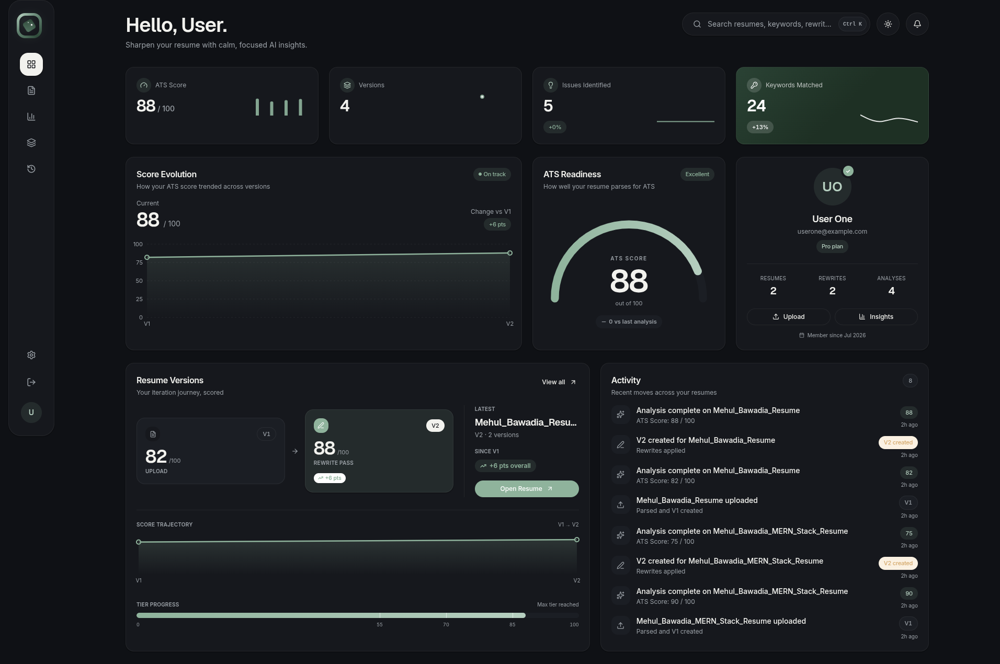

## Talentra

A MERN stack Gemini AI Powered Resume Checker application.

<p align="center">

</p>

### Installation

```bash
git clone git@github.com:MehulBawadia/mern-talentra.git

# For Backend
cd mern-talentra/backend
cp .env.example .env
npm install
npm run dev

# For Frontend
cd mern-talentra/frontend
npm install
npm run dev
```

### License

This project is an open-sourced software licensed under the [MIT License](https://opensource.org/license/mit)
